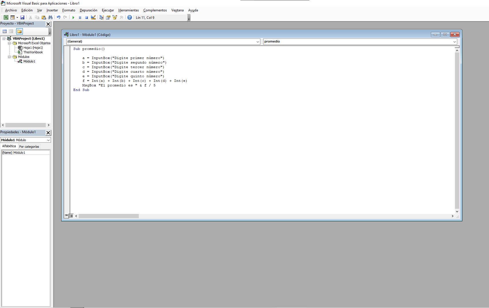
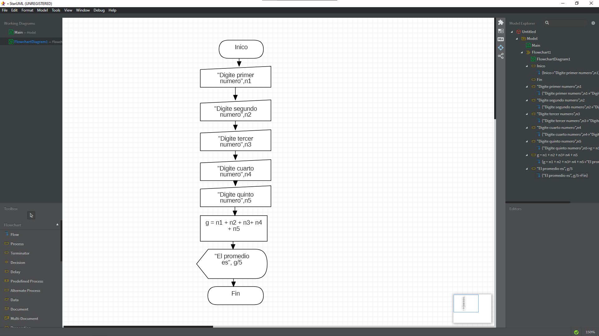

# CLASE SEPTIEMBRE 9

Sacar el promedio de 5 numeros fue lo que se trabajo en esta CLASE

# EJERCICIO EN -VISUAL BASIC-

```

Sub promedio()

    n1 = InputBox("Digita primer número")
    n2 = InputBox("Digite segundo número")
    n3 = InputBox("Digite tercer número")
    n4 = InputBox("Digite cuarto número")
    n5 = InputBox("Digite quinto número")
    g = Int(n1) + Int(n2) + Int(n3) + Int(n4) + Int(n5)
    MsgBox "El promedio es " & g / 5
End Sub

```



# DIAGRAMA DE FLUJO -STARUML-


