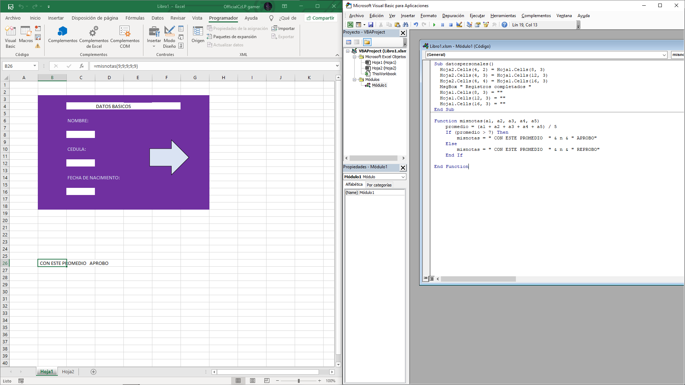

# CLASE SEPTIEMBRE 20

Actividad sobre las celdas y comando function

## CODIGO DE PRUEBA CELLS -VISUAL BASIC-

```
Sub datospersonales()
  Hoja2.Cells(4, 2) = Hoja1.Cells(8, 3)
  Hoja2.Cells(4, 3) = Hoja1.Cells(12, 3)
  Hoja2.Cells(4, 4) = Hoja1.Cells(16, 3)
  MsgBox " Registros completados "
  Hoja1.Cells(8, 3) = ""
  Hoja1.Cells(12, 3) = ""
  Hoja1.Cells(16, 3) = ""
End Sub

```


## CODIGO DE PRUEBA FUNCTION -VISUAL BASIC-

```

Function misnotas(a1, a2, a3, a4, a5)
    promedio = (a1 + a2 + a3 + a4 + a5) / 5
    If (promedio > 7) Then
        misnotas = " CON ESTE PROMEDIO  " & promedio & " APROBO"
    Else
        misnotas = " CON ESTE PROMEDIO  " & promedio & " REPROBO"
    End If

End Function


```


