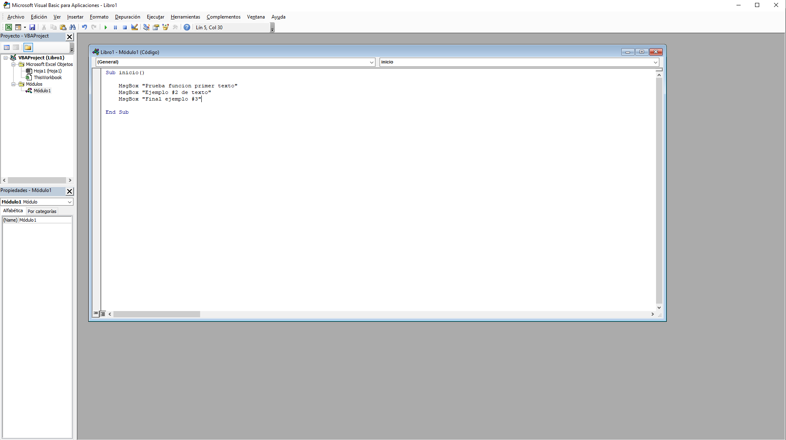
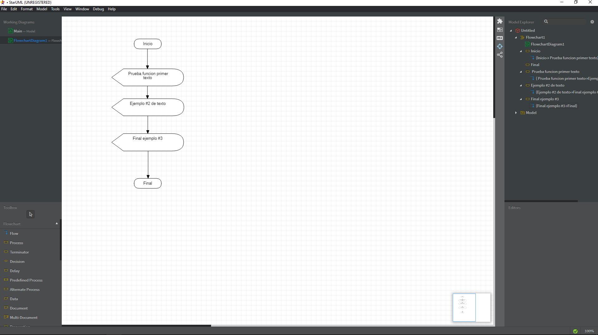

# CLASE SEPTIEMBRE 2

Conocimientos basicos sobre programacion, base a algoritmos simples, mediante ejercicios basicos

##  CODIGO DE PRUEBA EN EXCEL -VISUAL BASIC-

```
Sub inicio()

    MsgBox "Prueba funcion primer texto"
    MsgBox "Ejemplo #2 de texto"
    MsgBox "Final ejemplo #3"

End Sub
```


## CODIGO EN DART

```
void main(){
    print('Hola profesor');
}
```

## DIAGRAMA DE FLUJO -STARUML


